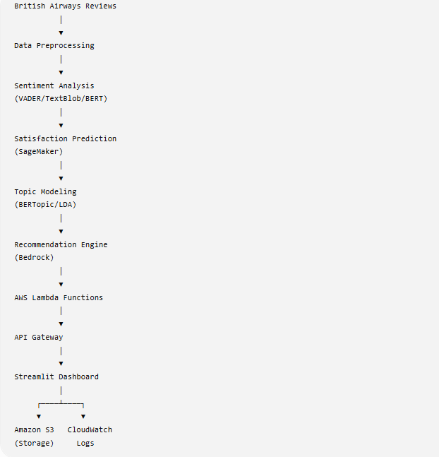
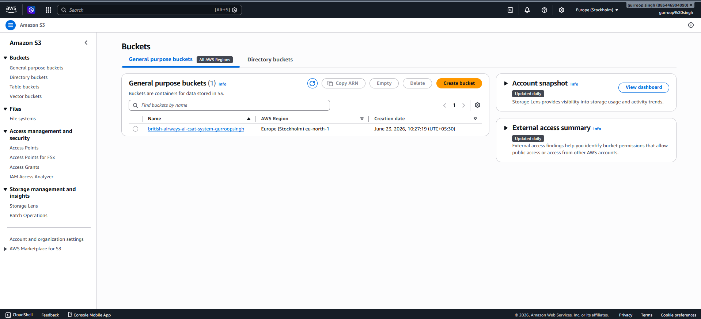
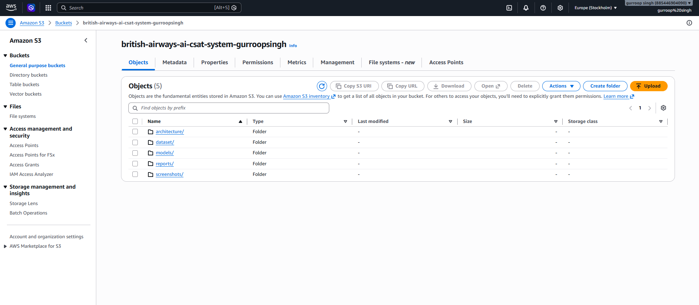

    
Course Project – Build AI with AWS

    
Week 3 Report: Infrastructure Setup

    

        <strong>Student Details:</strong> Gurroop Singh 
        <strong>Project:</strong> AI-Driven Predictive Customer Satisfaction and Personalized Experience Recommendations for British Airways 
        <strong>GitHub Repository:</strong> <a href="https://github.com/gurroopsingh/british-airways-ai-csat-system">https://github.com/gurroopsingh/british-airways-ai-csat-system</a>
    

       
    

<h1>Table of Contents</h1>
<ul>
    <li><a href="#introduction">1. Introduction & Project Proposal</a></li>
    <li><a href="#problem-statement">2. Problem Statement</a></li>
    <li><a href="#dataset-preprocessing">3. Dataset & Data Preprocessing</a></li>
    <li><a href="#architecture-services">4. Architecture Design & AWS Services</a></li>
    <li><a href="#infrastructure-setup">5. AWS Infrastructure Setup & S3 Usage</a></li>
    <li><a href="#challenges">6. Challenges Faced and Solutions</a></li>
    <li><a href="#future-enhancements">7. Future Enhancements</a></li>
    <li><a href="#conclusion">8. Conclusion & Resources</a></li>
</ul>

<h1 id="introduction">1. Introduction & Project Proposal</h1>
This project aims to develop a cloud-based AI application utilizing AWS services to intelligently process and analyze customer feedback for British Airways. By combining natural language processing (NLP), machine learning (ML), and serverless cloud infrastructure, the project automates the evaluation of customer reviews. It predicts customer satisfaction (CSAT) scores, extracts actionable topics, and explores Generative AI integrations to provide personalized recommendations, ultimately aiming to enhance the passenger experience.

<h1 id="problem-statement">2. Problem Statement</h1>

British Airways processes thousands of customer reviews and feedback forms daily. Manually analyzing these reviews to assess customer satisfaction, identify recurring issues, and provide timely recommendations is inefficient. Without an automated, intelligent system, addressing specific customer pain points (like flight delays, baggage handling, or customer service issues) takes too long, leading to a negative customer experience and potential brand damage.

<h1 id="dataset-preprocessing">3. Dataset & Data Preprocessing</h1>

The project leverages a comprehensive dataset of British Airways customer reviews (<code>british_airways_reviews.csv</code>). The automated data preprocessing pipeline identifies relevant text columns and applies rigorous NLP techniques including lowercase conversion, punctuation removal, tokenization, stopword removal, and lemmatization. The processed datasets (e.g., <code>cleaned_reviews.csv</code>) serve as the foundation for the subsequent machine learning and topic modeling phases.

<h1 id="architecture-services">4. Architecture Design & AWS Services</h1>

The solution employs an event-driven, serverless architecture that is designed to be scalable and cost-effective. The following AWS services are utilized or configured for this project:

<ul>
    <li><strong>Amazon S3:</strong> Serves as the primary data lake for storing raw/processed datasets and machine learning model artifacts (<code>.joblib</code> files).</li>
    <li><strong>AWS Lambda:</strong> Provides serverless compute to execute the backend logic for sentiment analysis, CSAT predictions, and generative recommendations.</li>
    <li><strong>Amazon API Gateway:</strong> Exposes the Lambda functions as secure, scalable REST APIs.</li>
    <li><strong>Amazon SageMaker:</strong> Utilized via notebook environments for the experimental training and evaluation of the CSAT prediction models (Random Forest and XGBoost).</li>
    <li><strong>Amazon Bedrock:</strong> Configured to explore Generative AI models for dynamically generating personalized customer service recommendations.</li>
    <li><strong>Amazon CloudWatch:</strong> Monitors the execution of Lambda functions and API Gateway requests.</li>
</ul>

Figure 1: Complete end-to-end cloud infrastructure and AI workflow diagram.

<h1 id="infrastructure-setup">5. AWS Infrastructure Setup & S3 Usage</h1>

The foundational cloud infrastructure was successfully provisioned. Amazon S3 buckets were configured to securely hold the structured datasets and serialized machine learning artifacts required by the Lambda functions.

Figure 2: Amazon S3 Bucket configuration for dataset and artifact storage.

Figure 3: Uploaded model artifacts and processed datasets securely stored in S3.

<h1 id="challenges">6. Challenges Faced and Solutions</h1>

<strong>Challenge:</strong> Integrating complex NLP libraries and large machine learning models within the constraints of AWS Lambda deployment packages. 
<strong>Solution:</strong> The solution architecture was optimized to serialize minimal necessary components (like TF-IDF vectorizers and Random Forest models) into S3. The Lambda functions retrieve these artifacts at runtime, circumventing the strict package size limits and enabling serverless inference without deploying heavy persistent endpoints.

<h1 id="future-enhancements">7. Future Enhancements</h1>
<ul>
    <li>Implementation of Infrastructure as Code (IaC) using AWS CloudFormation or Terraform to automate the deployment of S3 buckets and API Gateway configurations.</li>
    <li>Setting up automated Amazon EventBridge triggers to re-train the models periodically as new reviews land in the S3 bucket.</li>
</ul>

<h1 id="conclusion">8. Conclusion & Resources</h1>

Week 3 successfully established the foundational AWS infrastructure, defined the core business problem, and implemented the critical data preprocessing pipelines. The architecture leverages Amazon S3 as a reliable storage layer, paving the way for the serverless backend development in Week 4.

<h1 id="references">9. References</h1>
<ul>
    <li>AWS Documentation: <a href="https://docs.aws.amazon.com/">https://docs.aws.amazon.com/</a></li>
    <li>Streamlit Documentation: <a href="https://docs.streamlit.io/">https://docs.streamlit.io/</a></li>
    <li>GitHub Repository: <a href="https://github.com/gurroopsingh/british-airways-ai-csat-system">https://github.com/gurroopsingh/british-airways-ai-csat-system</a></li>
</ul>
