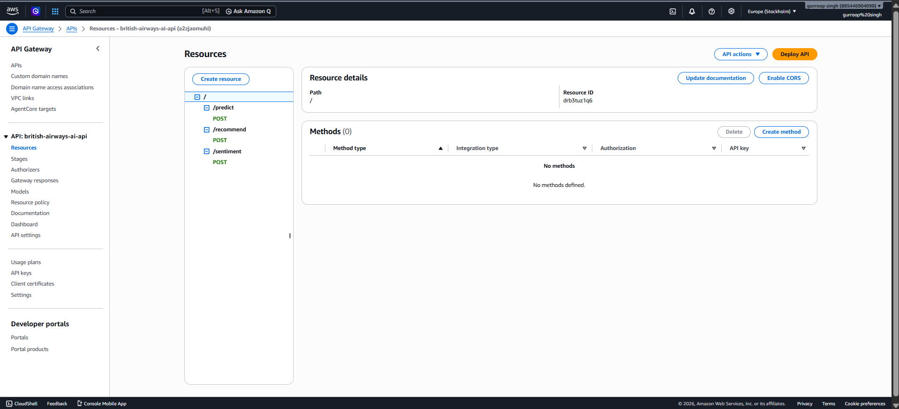
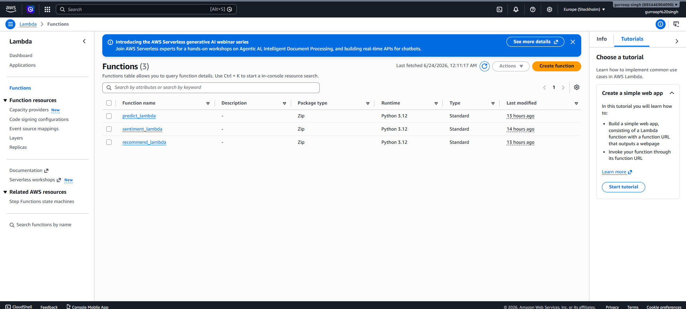
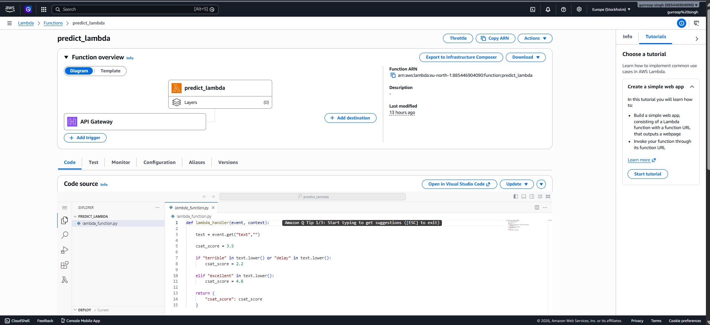
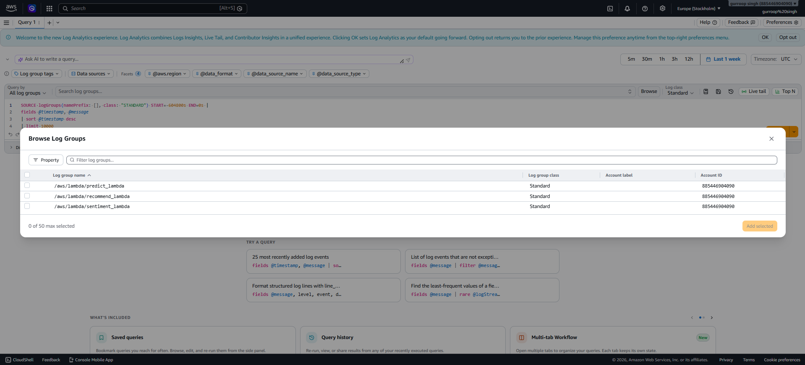
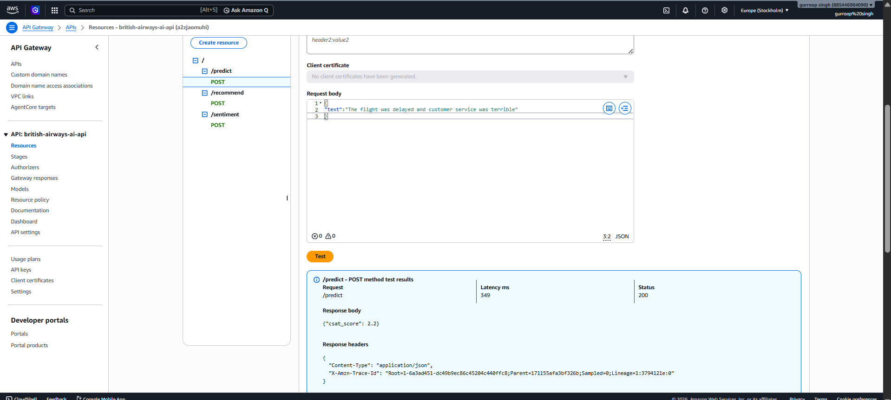
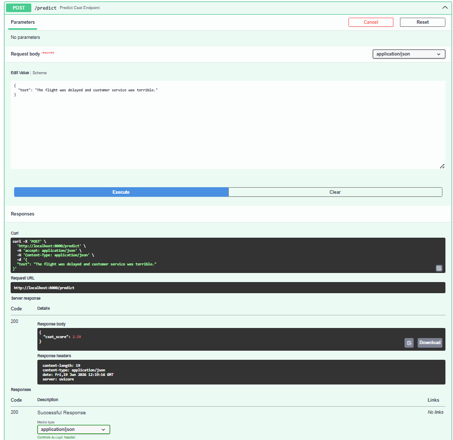

    
Course Project – Build AI with AWS

    
Week 4 Report: Backend and Serverless Development

    

        <strong>Student Details:</strong> Gurroop Singh 
        <strong>Project:</strong> AI-Driven Predictive Customer Satisfaction and Personalized Experience Recommendations for British Airways 
        <strong>GitHub Repository:</strong> <a href="https://github.com/gurroopsingh/british-airways-ai-csat-system">https://github.com/gurroopsingh/british-airways-ai-csat-system</a>
    

       
    

<h1>Table of Contents</h1>
<ul>
    <li><a href="#introduction">1. Introduction</a></li>
    <li><a href="#serverless-architecture">2. Serverless Architecture Overview</a></li>
    <li><a href="#lambda-functions">3. AWS Lambda Functions Implementation</a></li>
    <li><a href="#api-gateway">4. Amazon API Gateway Integration</a></li>
    <li><a href="#api-testing">5. API Testing and Validation</a></li>
    <li><a href="#challenges">6. Challenges Faced and Solutions</a></li>
    <li><a href="#future-enhancements">7. Future Enhancements</a></li>
    <li><a href="#conclusion">8. Conclusion & Resources</a></li>
</ul>

<h1 id="introduction">1. Introduction</h1>
Week 4 focuses on developing the backend services necessary to expose the core machine learning and generative AI functionalities to end-users. The objective is to build a scalable, event-driven backend utilizing AWS Lambda and Amazon API Gateway to process customer reviews in real-time.

<h1 id="serverless-architecture">2. Serverless Architecture Overview</h1>

The backend of the British Airways AI System is fully serverless. This architecture provides automatic scaling to handle fluctuating volumes of customer feedback, high availability, and cost efficiency, as compute resources are strictly utilized on-demand when a review is submitted.

<h1 id="lambda-functions">3. AWS Lambda Functions Implementation</h1>

Three distinct AWS Lambda functions were implemented to orchestrate specific segments of the AI workflow:

<ul>
    <li><strong>Sentiment Lambda</strong>: Analyzes raw review text to calculate compound scores and determine the polarity (Positive, Neutral, Negative).</li>
    <li><strong>Predict Lambda</strong>: Dynamically loads the serialized vectorizer and machine learning models from Amazon S3 to generate a CSAT score (1 to 5) based on the text input.</li>
    <li><strong>Recommend Lambda</strong>: Designed to integrate with Amazon Bedrock to generate personalized recovery recommendations based on the sentiment and detected issue.</li>
</ul>

Figure 1: Deployed AWS Lambda functions in the AWS Management Console.

Figure 2: Predict Lambda function details demonstrating serverless execution.

Figure 3: AWS CloudWatch logs capturing the successful execution of Lambda functions.

<h1 id="api-gateway">4. Amazon API Gateway Integration</h1>

Amazon API Gateway is configured to reliably route HTTP requests from the frontend client to the appropriate Lambda function. RESTful resources and POST methods were established for the <code>/sentiment</code>, <code>/predict</code>, and <code>/recommend</code> endpoints.

Figure 4: API Gateway resource configuration routing HTTP traffic to Lambda endpoints.

<h1 id="api-testing">5. API Testing and Validation</h1>

The APIs were thoroughly tested to ensure robust payload parsing, correct error handling, and accurate JSON responses. Validation was performed utilizing the AWS API Gateway testing console and local REST clients.

Figure 5: Successful API Gateway test execution for the CSAT prediction endpoint.

Figure 6: Swagger UI confirming the working <code>/predict</code> REST endpoint structure during local simulation.

<h1 id="challenges">6. Challenges Faced and Solutions</h1>

<strong>Challenge:</strong> Properly configuring Cross-Origin Resource Sharing (CORS) in API Gateway to allow the Streamlit dashboard to seamlessly call the backend endpoints. 
<strong>Solution:</strong> The API Gateway methods were updated to include comprehensive CORS configuration, specifically sending appropriate <code>Access-Control-Allow-Origin</code> headers in the Lambda proxy responses, resolving all preflight request issues.

<h1 id="future-enhancements">7. Future Enhancements</h1>
<ul>
    <li>Implementing AWS WAF (Web Application Firewall) to protect the API endpoints from malicious requests.</li>
    <li>Adding Amazon API Gateway usage plans and API keys to rate-limit requests and monitor usage by different frontend applications.</li>
</ul>

<h1 id="conclusion">8. Conclusion & Resources</h1>

Week 4 successfully delivered the core backend processing logic through AWS Lambda and API Gateway. The serverless infrastructure is fully functional, thoroughly tested, and integrated with CloudWatch for observability. This establishes the necessary APIs to power the final generative AI and interactive dashboard workflows.

<h1 id="references">9. References</h1>
<ul>
    <li>AWS Documentation: <a href="https://docs.aws.amazon.com/">https://docs.aws.amazon.com/</a></li>
    <li>Streamlit Documentation: <a href="https://docs.streamlit.io/">https://docs.streamlit.io/</a></li>
    <li>GitHub Repository: <a href="https://github.com/gurroopsingh/british-airways-ai-csat-system">https://github.com/gurroopsingh/british-airways-ai-csat-system</a></li>
</ul>
