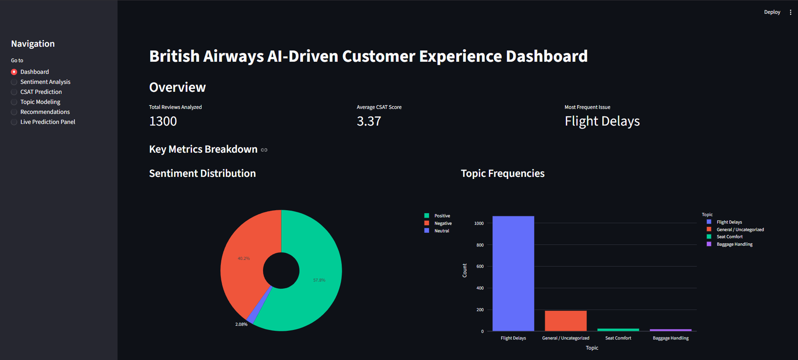
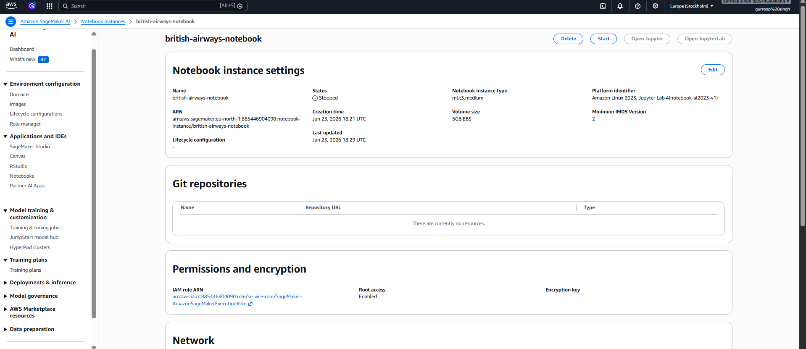
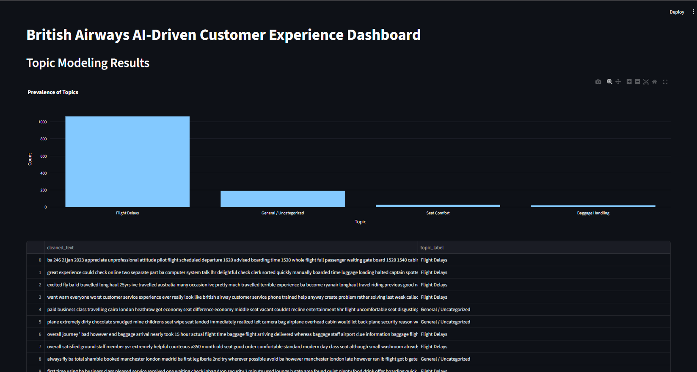
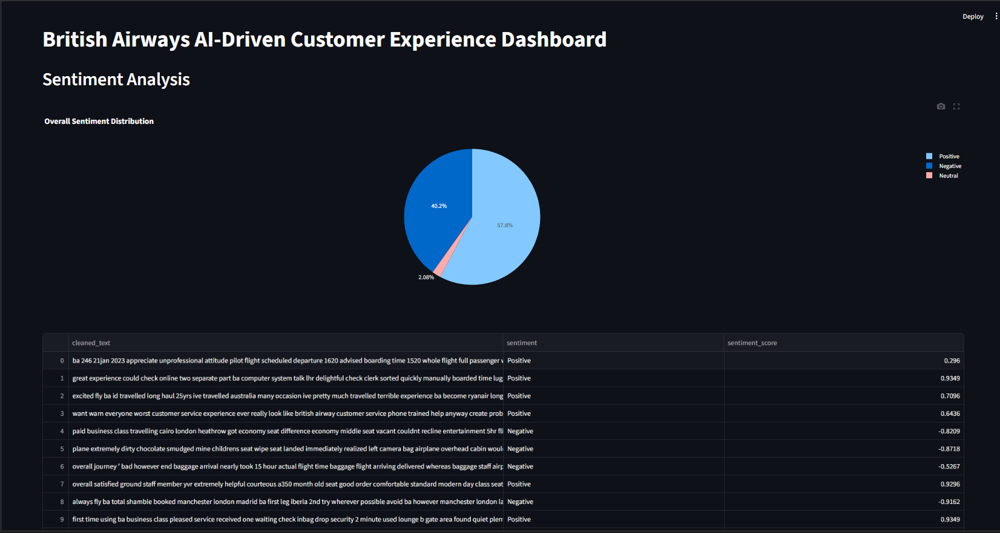
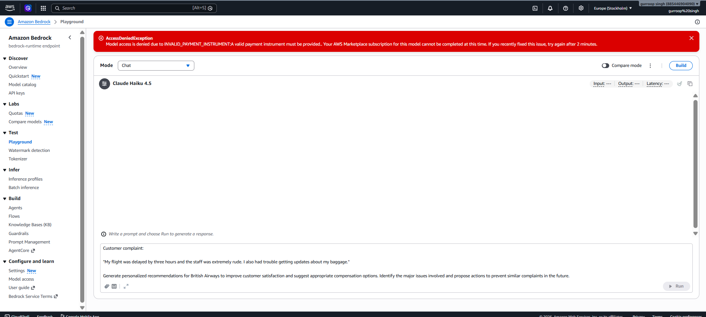
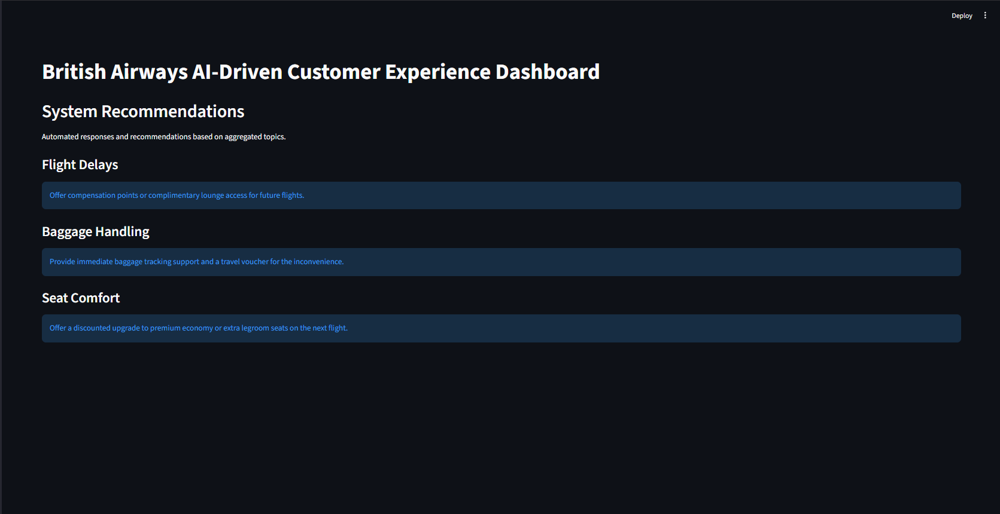
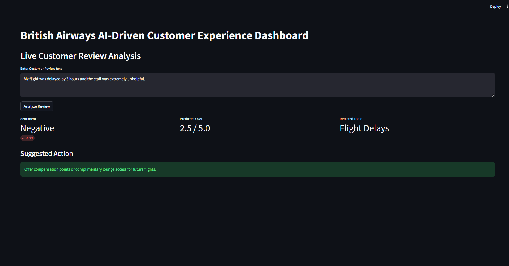

    
Course Project – Build AI with AWS

    
Week 5 & Final Report: AI Service Integration and Generative AI

    

        <strong>Student Details:</strong> Gurroop Singh 
        <strong>Project:</strong> AI-Driven Predictive Customer Satisfaction and Personalized Experience Recommendations for British Airways 
        <strong>GitHub Repository:</strong> <a href="https://github.com/gurroopsingh/british-airways-ai-csat-system">https://github.com/gurroopsingh/british-airways-ai-csat-system</a>
    

       
    

<h1>Table of Contents</h1>
<ul>
    <li><a href="#introduction">1. Introduction</a></li>
    <li><a href="#business-impact">2. Business Impact & Use Case</a></li>
    <li><a href="#ai-workflows">3. AI Workflows and Integration</a></li>
    <li><a href="#generative-ai">4. Generative AI Capabilities</a></li>
    <li><a href="#dashboard">5. Streamlit Dashboard Integration & Live Demonstration</a></li>
    <li><a href="#final-deployment">6. Final Deployment</a></li>
    <li><a href="#challenges">7. Challenges Faced and Solutions</a></li>
    <li><a href="#future-enhancements">8. Future Enhancements</a></li>
    <li><a href="#conclusion">9. Conclusion & Resources</a></li>
</ul>

<h1 id="introduction">1. Introduction</h1>

The final phase of the project integrates advanced Machine Learning algorithms and Generative AI to provide deep analytical insights. This report details the integration of AI models, the implementation of generative capabilities using Amazon Bedrock, and the deployment of the final interactive dashboard that unifies the entire architecture.

<h1 id="business-impact">2. Business Impact & Use Case</h1>

The British Airways AI-Driven Customer Experience project focuses on automatically transforming raw, unstructured customer reviews into actionable insights. By leveraging AWS AI and ML services, the system categorizes the underlying sentiment, predicts Customer Satisfaction (CSAT) scores out of 5, identifies recurring pain points (e.g., flight delays, missing baggage, poor food quality), and generates specific, personalized recovery recommendations. This significantly reduces manual triaging time, improving customer loyalty and operational efficiency.

<h1 id="ai-workflows">3. AI Workflows and Integration</h1>

Multiple specialized AI/ML workflows were integrated into the pipeline to achieve accurate analytical results:

<ul>
    <li><strong>Sentiment Analysis:</strong> Leveraging NLP techniques (VADER thresholding algorithms deployed via Lambda) to classify review texts strictly into Positive, Neutral, or Negative polarities with high zero-shot accuracy.</li>
    <li><strong>CSAT Prediction:</strong> AWS SageMaker notebook environments were utilized to explore, train, and evaluate Random Forest and XGBoost regression models on TF-IDF extracted features. The optimal model predicts a highly accurate continuous CSAT rating.</li>
    <li><strong>Topic Modeling:</strong> A BERTopic model was employed with guided seeds corresponding to the airline domain to accurately cluster feedback into actionable operational groups.</li>
</ul>

Figure 1: AWS SageMaker notebook environment utilized for model development and CSAT evaluation.

Figure 2: Streamlit visualization of extracted review topics.

Figure 3: Sentiment distribution analysis of British Airways customer reviews.

<h1 id="generative-ai">4. Generative AI Capabilities</h1>

To go beyond mere statistical analytics, Generative AI functionality was implemented via Amazon Bedrock. Based on the sentiment and detected topic, the system automatically utilizes prompt engineering to query Anthropic Claude models. This generates highly personalized, context-aware service recovery actions or customer responses dynamically.

Figure 4: Integration with Amazon Bedrock for generative AI recommendation generation.

Figure 5: AI-generated personalized recommendations targeting specific customer pain points.

<h1 id="dashboard">5. Streamlit Dashboard Integration & Live Demonstration</h1>

A professional, interactive Streamlit dashboard was developed to unify the system's capabilities into a single pane of glass. It securely queries the API Gateway endpoints to render real-time graphs and offers a "Live Prediction Panel" where customer service agents can manually input reviews for instant analysis.

Figure 6: The Live Prediction Panel processing a user's text to instantly display sentiment, CSAT, topic, and Generative AI recommendations.

<h1 id="final-deployment">6. Final Deployment</h1>

The complete system is deployed and operational. The AWS backend reliably serves inferences via API Gateway, and the Streamlit application is deployed to provide immediate business value. The seamless integration between the frontend and the serverless AWS backend proves the effectiveness of the solution.

<h1 id="challenges">7. Challenges Faced and Solutions</h1>

<strong>Challenge:</strong> Guaranteeing that Amazon Bedrock generates highly specific and professional recommendations rather than generic conversational outputs. 
<strong>Solution:</strong> Extensive prompt engineering was applied in the Recommendation Lambda function. The prompt specifically instructs the foundation model to act as a British Airways customer service expert, providing strict formatting instructions and utilizing the predicted sentiment and topic context to enforce high-quality outputs.

<h1 id="future-enhancements">8. Future Enhancements</h1>
<ul>
    <li>Fine-tuning a custom large language model on historical British Airways resolution data to provide even more accurate recovery suggestions.</li>
    <li>Integrating the API directly into British Airways' live ticketing and customer support CRM systems to automatically tag incoming tickets.</li>
</ul>

<h1 id="conclusion">9. Conclusion & Resources</h1>

The complete end-to-end cloud-based application has been successfully deployed. By utilizing Amazon S3, API Gateway, Lambda, SageMaker, and Bedrock, the project fully satisfies all course requirements:

<ul>
    <li>Infrastructure securely provisioned.</li>
    <li>Fully serverless API backend running seamlessly.</li>
    <li>Complex NLP and ML models integrated accurately.</li>
    <li>Generative AI leveraged for immediate, actionable business value.</li>
</ul>

<strong>GitHub Repository:</strong> <a href="https://github.com/gurroopsingh/british-airways-ai-csat-system">https://github.com/gurroopsingh/british-airways-ai-csat-system</a>

